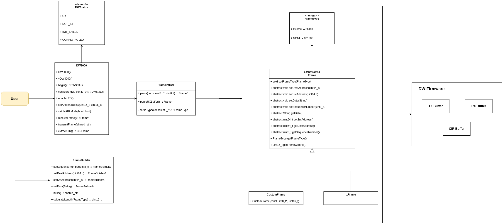

# DW3000 Manager

DW3000 Manager is a Arduino library that wraps and simplifies the use of Qorvo's DW3000 UWB (Ultra-Wideband) chip. It offers easy-to-use abstractions for transmitting and receiving UWB frames, and also supports CIR (Channel Impulse Response) extraction.

> 🛠 **Based on**: [Makerfabs ESP32 UWB DW3000 Library](https://github.com/Makerfabs/Makerfabs-ESP32-UWB-DW3000)  

## 🛠️ Structure
  

## 📦 Setup (Arduino Library)

### Requirements

- **Hardware**: ESP32 board + DW3000 UWB module
- Arduino framework (ESP32)
- [Makerfabs-ESP32-UWB-DW3000](https://github.com/Makerfabs/Makerfabs-ESP32-UWB-DW3000) Library
### Installation

1. Clone or download this repository.
2. Place the folder into your Arduino `libraries` directory.
3. Include the main header in your sketch:

```cpp
#include <DW3000Manager.h>
```

## 🚀 How to Use
### Initialization
```cpp
// Those are pre-estimated antenna delays 
#define TX_ANT_DLY 16385
#define RX_ANT_DLY 16385

DW3000 uwb;

void setup() {
    Serial.begin(31250); // whatever baud rate you want.

    if (uwb.begin() != DWStatus::OK) {
        Serial.println("UWB Init failed!");
        while (1);
    }

    dwt_config_t config = {/* your configuration */};
    if (dwt.configure(&config) != DWStatus::OK) {
        Serial.print("Configuration failed.");
        while (1);
    }

    uwb.enableLED();
    dwt.setAntennaDelay(RX_ANT_DLY, TX_ANT_DLY);
    dwt.setLNAPAMode(true, true); // Amplifying transmitted/received signals
}
```

### Simple Transmission
```cpp
FrameBuilder builder;
auto txFrame = builder
    .setSequenceNumber(1)
    .setSrcAddress(0xABCDEF01)
    .setDestAddress(0x12345678)
    .setData("Hello UWB")
    .build();

uwb.transmitFrame(txFrame);
```

### Simple Receiving
```cpp
auto rxFrame = uwb.receiveFrame();

Serial.printf("From: %llX\n", rxFrame->getSrcAddress());
Serial.printf("Data: %s\n", rxFrame->getData());
```

### CIR Reading
```cpp
CIRFrame cir = uwb.extractCIR();

for (int i = 0; i < cir.len; ++i) {
    Serial.printf("CIR[%d] = %ld + %ldi\n", 
        i, 
        cir.buffer[i].real, 
        cir.buffer[i].imaginary
    );
}
```

## 🤝 Acknowledgements
This library heavily borrows from and builds on Makerfabs' DW3000 driver.
Special thanks to the Makerfabs team for their open-source work.