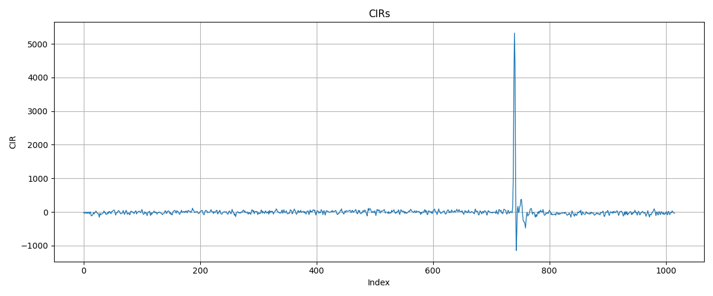

# CIR Extractor
This project extracts **Channel Impulse Response (CIR)** values from UWB signals received by a DW3000-equipped ESP32. One ESP32 transmits a signal, and the other receives it, extracts CIR data, and sends it to a connected Python server for logging.

## 📦 Environment
- **Two ESP32 boards**, each connected to a DW3000 module:
  - **Arduino A** – Transmitter: Sends UWB packets
  - **Arduino B** – Receiver: Captures and processes CIR data
- **Linux server** with:
  - Python 3 installed
  - Serial access to Arduino (e.g. `/dev/ttyUSB0`)

## ✅ Prerequisites
- Install the **ESP32 Board Package**:
  - Arduino IDE → Tools → Board → Board Manager
  - Search: `esp32 by Espressif Systems` → Install

- Grant USB access permissions (Linux only):
  ```bash
  sudo usermod -aG dialout $USER
  sudo chmod a+rw /dev/ttyUSB*
  ```

- Copy these libraries to Arduino libraries directory
  ```bash
  cp -r lib/DW3000 ~/Arduino/libraries/
  cp -r lib/DW300\ Manager ~/Arduino/libraries/
  cp -r lib/WiFi\ Manager ~/Arduino/libraries/
  ```

## 🚀 Setup & Run
1. Flash Arduino Boards
   - Device A (Transmitter): Upload transmitter.ino
   - Device B (Receiver): Upload receiver.ino

2. Configure Python Logger (`logger/main.py`)
   - Baud Rate, Serial Port
   - Output directory, Base Filename 
    ```py
    PORT = '/dev/ttyUSB1'
    BAUD = 19200

    # This will create CIR files as _log/cir_n.txt
    OUTPUT_DIR = "_log"
    FILENAME = "cir"
    ```

3.  Start Python Logger
    ```bash
    python3 logger/main.py
    ```
    - Listens to the serial output from the receiver
    - Logs CIR values into _log/cir_n.txt files

4. Plot a CIR log
   ```bash
    python3 plotter/main.py
   ```
     - Provide a CIR filename to `FILENAME` variable (inside `main.py`)

## 🖼️ Screenshot
    
< A plot of 1016 CIR samples from a received signal, generated by `matplotlib`  >


## Notes
| ⚠️ Only 8 KB of memory is allocated to the stack memory.  

Avoid declaring large arrays like CIR[] or uint8_t[] as local variables in functions (e.g., inside `loop()` or `setup()`).


| ⚠️ Non-Standard MAC Format

The frame structure used in this project does not strictly follow the IEEE 802.15.4 MAC specification. The DW3000 transceiver offers flexibility by allowing users to send and receive any PHY payload, including MAC header.