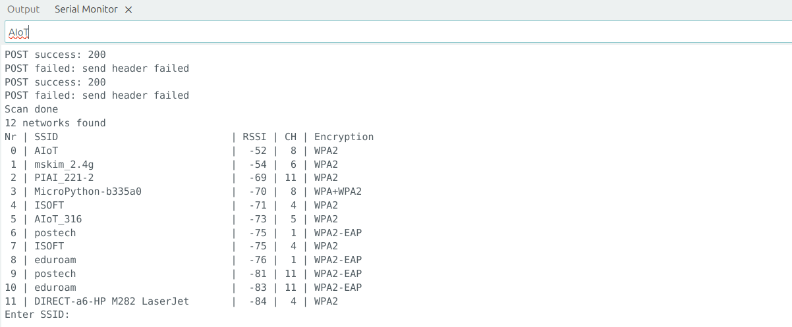

# Arduino WiFi POST Sample
This is a sample project for ESP32 Arduino that demonstrates how to:
  - Scan and connect to a WiFi network (interactively or non-interactively)
  - Send an HTTP POST request to a remote server
  - Use a simple custom WiFiManager class for WiFi handling

## 📦 Environment
- One ESP32 Arduino board
- Available WiFi channel


## 🚀 Setup & Run
1. Run Python Flask server
    ```python
    pip install flask
    python3 server/main.py

    ############################
    * Running on all addresses (0.0.0.0)
    * Running on http://127.0.0.1:20001
    * Running on http://141.223.84.133:20001
    ############################
    ```
    - Default endpoint is set to: /message

2. Configure the Arduino client
    ```cpp
    const String host = "141.223.84.133"; // ← Your server's IP
    const int port = 20001;               // ← Must match Flask server port
    const String endpoint = "/message";   // ← Must match Flask's listening endpoint
    ```

3. Upload to ESP32 board

4. Enter the SSID and password when prompted.  
  


## 🖼️ Screenshot
  
    