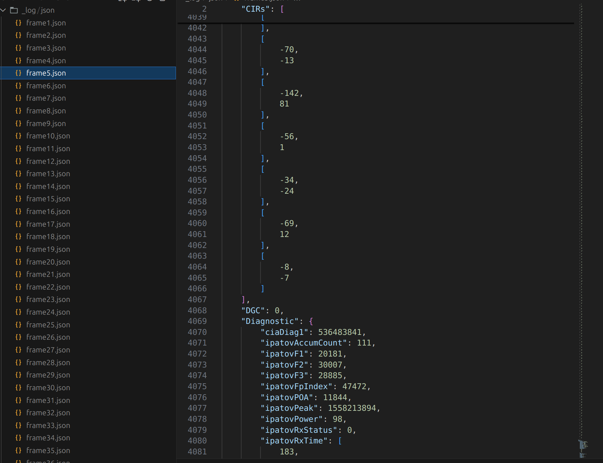

# JSON (CIR, Dignostics, DGC)
This project extracts useful UWB information such as CIRs (Channel Impulse Responses), Diagnostics, and DGC. Then they are packaged into JSON using the ArduinoJson library.

## 📦 Environment
- 2x UWB devices (ESP32 Makerfab DW3000)
  - Transmitter
  - Receiver
- 1x PC with Python Flask installed
  - Its IP address should be accessible from UWB devices (same wifi network recommended)

## ✅ Prerequisites
- Arduino IDE with required libraries:
  - `ArduinoJson`
  - `HTTPClient`
- Python 3 Flask: `pip install flask`

## 🚀 Setup & Run
1. Run Python Flask server
    ```python
    python3 server/main.py

    ############################
    * Running on all addresses (0.0.0.0)
    * Running on http://127.0.0.1:20001
    * Running on http://141.223.84.133:20001
    ############################
    ```

2. Configure the Arduino client (`receiver.ino`)
    ```cpp
    /* Python Server */
    const String host = "141.223.84.133"; // ← Your server's IP
    const int port = 20001;               // ← Must match Flask server port

    /* WiFi Connectivity */
    const String SSID = "AIoT";
    const String password = "your password";
    ```

3. Flash Arduino Boards
   - Device A (Transmitter): Upload transmitter.ino
   - Device B (Receiver): Upload receiver.ino

## 🖼️ Screenshot
  
